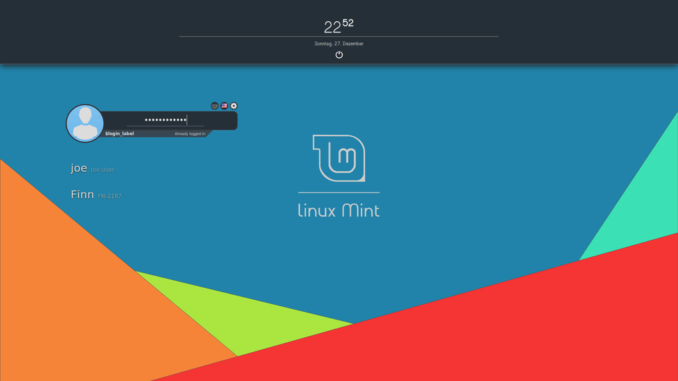
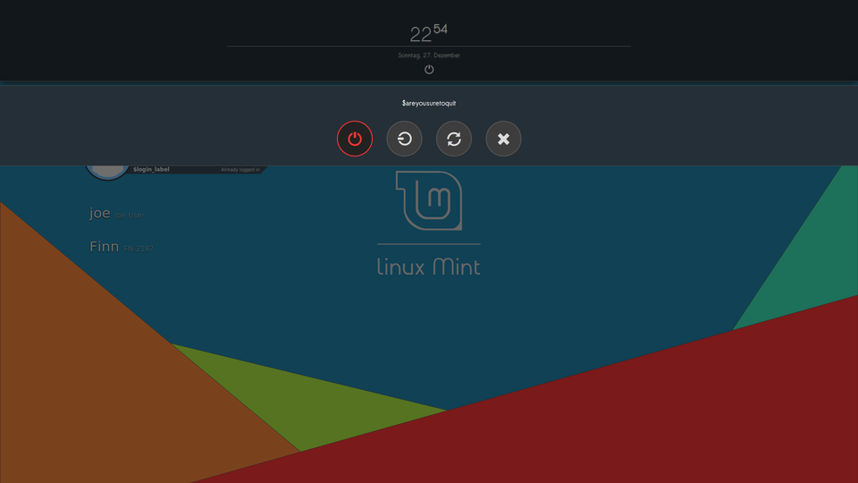

# Agave for MDM

[MDM-Numix]: http://zagortenay333.deviantart.com/art/MDM-Numix-427299252
[eleMINTary]: http://linuxmint-art.org/content/show.php?content=159006
This is a HTML5-theme for the login greeters MDM/GDM. It is inspired by [MDM-Numix] and [eleMINTary].
It features vibrant colors, a reduced, rounded design and a time and date dash.

**Version 1.2**
*Tested with MDM 2.0.7*

## Installation

*Caution*: You will need to rename the file extension `.zip` to `tar.gz` since GitHub only supports ZIP-file downloads for releases.  
Simply open the login screen settings (on Linux Mint under system settings) and import the archive.  
**Manual installation**: Extract the archive to `/usr/share/mdm/html-themes` (requires root privileges)

## ToDo

- [x]  design for shutdown dialogues
- [] select background aspect ratio according to screen size
- [] design for session/language menu
- [] design for error messages
- [] support different time zones
- [] rewrite CSS with SASS
- [] code cleanup CSS

## Known Issues

The highlight effect from the onscreen keyboard is a little glitchy.
